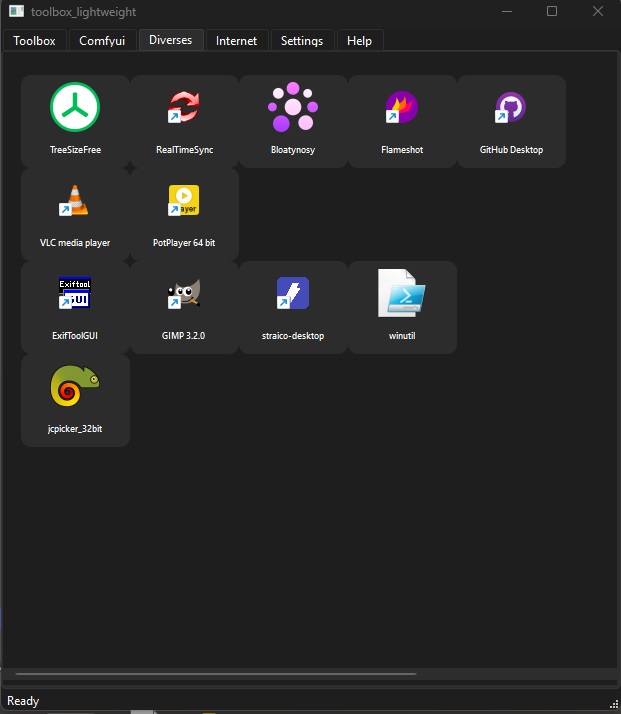
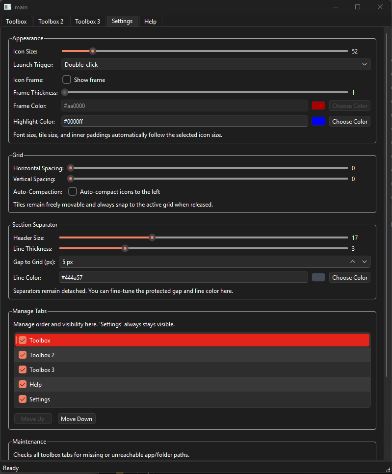

# Toolbox

Desktop toolbox launcher built with Python and PySide6.

## Latest Release

- Version: `0.42-beta`
- Windows executable: `toolbox_v0.42-beta.exe`
- Location: repository root (already included)

## Screenshots




## Highlights

- Multiple toolbox tabs with reorder/visibility management
- Drag-and-drop app entries and section separators
- Multi-select movement with structure-preserving behavior
- Grid snapping with optional auto-compaction
- Separator protection and snapping with conflict hints
- Per-section and global separator/title color management (all tabs)
- Configurable separator spacing with separate `Gap Above` and `Gap Below`
- Per-tab canvas background color via right-click menu
- Tool launch options (args, working dir, wait mode, admin)
- Image-file thumbnail previews with `Fit` / `Fill and crop`
- Video-file thumbnail previews (ffmpeg-based)
- FFmpeg source detection with status display in Settings (env/manual/system/internal)
- Manual FFmpeg path field in Settings (with browse + rescan)
- Hover-enlarged media preview (optional, configurable in Settings)
- Persistent thumbnail cache with pre-generated `normal` + `HQ` variants
- Broken-entry diagnostics and optional cleanup
- JSON import/export for toolbox state and UI settings
- Keyboard undo/redo (`Ctrl+Z`, `Ctrl+Y`)

## Requirements

- Python 3.13
- PySide6
- pytest (for running tests)
- `ffmpeg` (optional, only needed for video thumbnail previews)

## Setup

```powershell
python -m venv .venv
.venv\Scripts\Activate.ps1
pip install -U pip
pip install pyside6 pytest
```

## Run

```powershell
python main.py
```

## Test

```powershell
$env:PYTHONPATH='.'
pytest -q
```

## Usage Notes

- Most layout/style changes in `Settings` apply after `Save & Apply`.
- If you leave `Settings` with unsaved changes and switch to a toolbox tab, pending settings are auto-applied.
- Tile positions snap to the active grid, so visible spacing changes in row-sized steps.
- `Check Broken Entries` runs in the background and shows results when scanning is done.
- Hover preview only appears when media preview is enabled and `Hover Preview` is checked.

## ffmpeg Notes (Video Preview)

- Runtime lookup order:
  - `TOOLBOX_FFMPEG_PATH`
  - manual path from Settings
  - system `PATH`
  - common Windows install locations
  - bundled binaries next to the executable / `_MEIPASS`
- PyInstaller spec supports optional ffmpeg/ffprobe bundling:
  - `TOOLBOX_FFMPEG_BINARY`
  - `TOOLBOX_FFPROBE_BINARY`
- In Settings, the FFmpeg section shows the currently detected source and resolved executable path.

## Third-Party Licensing

- This project can distribute FFmpeg/FFprobe binaries for video preview support.
- If FFmpeg is bundled with your release, you must comply with FFmpeg/GPL obligations for that binary build.
- See [THIRD_PARTY_NOTICES.md](THIRD_PARTY_NOTICES.md) for source references and legal links used by this project.

## Project Layout

- `main.py`: app entry point
- `app/`: application modules (UI, features, services, domain)
- `tests/`: unit tests

## License

MIT License. See [LICENSE](LICENSE).
