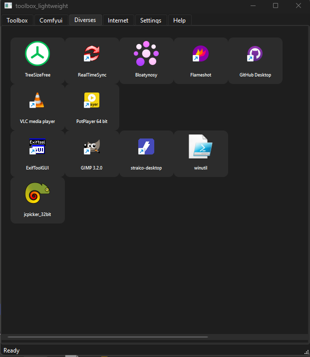
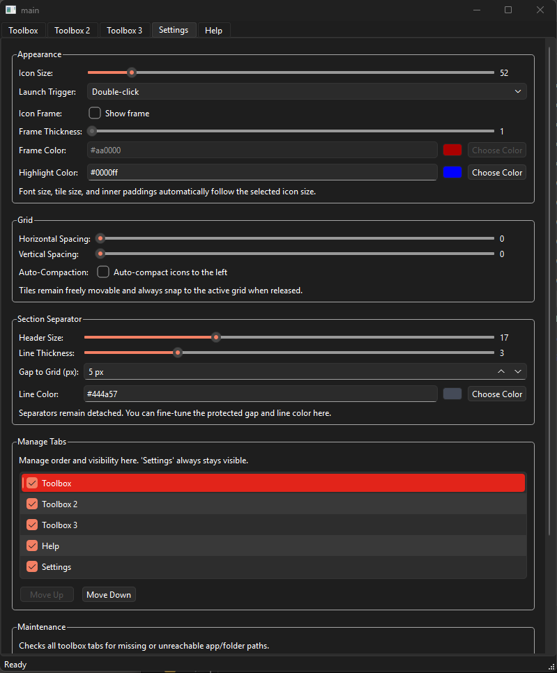

# Toolbox

Desktop toolbox launcher built with Python and PySide6.

## Latest Release

- Version: `0.42-beta`
- Linux AppImage build output: `dist-appimage/Toolbox-0.42-beta-x86_64.AppImage`
- Windows executable builds remain supported by `toolbox_lightweight.spec`

## Screenshots




## Highlights

- Multiple toolbox tabs with reorder/visibility management
- Multiple synchronized windows in one safe application process (`Ctrl+N`)
- Drag-and-drop app entries and section separators
- Multi-select movement with structure-preserving behavior
- Grid snapping with optional auto-compaction
- Separator protection and snapping with conflict hints
- Per-section and global separator/title color management (all tabs)
- Configurable separator spacing with separate `Gap Above` and `Gap Below`
- Per-tab canvas background color via right-click menu
- Automatic or manually adjustable tile-title font size in Settings
- Persistent per-folder icon sizes directly in the open folder's breadcrumb bar
- Independently configurable system-tray visibility and minimize-on-close behavior
- Tool launch options (args, working dir, wait mode, admin)
- Image-file thumbnail previews with `Fit` / `Fill and crop`
- Video-file thumbnail previews (ffmpeg-based)
- FFmpeg source detection with status display in Settings (env/manual/system/internal)
- Manual FFmpeg path field in Settings (with browse + rescan)
- Hover-enlarged media preview (optional, configurable in Settings)
- Persistent thumbnail cache with pre-generated `normal` + `HQ` variants
- Broken-entry diagnostics and optional cleanup
- Linux `.desktop` metadata, native theme icons, monitored launch failures, and
  `%f` / `%F` / `%u` / `%U` tile-drop support
- JSON import/export for toolbox state and UI settings
- Keyboard undo/redo (`Ctrl+Z`, `Ctrl+Y`)

## Requirements

- Python 3.11
- PySide6
- pytest (for running tests)
- `ffmpeg` (optional, only needed for video thumbnail previews)

## Windows Setup

```powershell
py -3.11 -m venv .venv
.venv\Scripts\Activate.ps1
python -m pip install -U pip
python -m pip install -r requirements-dev.txt
```

## Run

```powershell
.venv\Scripts\python.exe main.py
```

On Windows, `start-toolbox.bat` is the recommended launcher. It creates the `.venv`
with Python 3.11 when needed, installs missing runtime dependencies, and starts the GUI
with `.venv\Scripts\pythonw.exe`.

## Linux Development Setup

Linux Mint 22.3 uses Python 3.12 by default. Install the venv package once, then
create an isolated environment:

```bash
sudo apt install python3-venv desktop-file-utils libfuse2t64
python3 -m venv .venv
.venv/bin/python -m pip install -U pip
.venv/bin/python -m pip install -r requirements-dev.txt
QT_QPA_PLATFORM=xcb .venv/bin/python main.py
```

The application stores Linux configuration in
`${XDG_CONFIG_HOME:-$HOME/.config}/toolbox`.

## Build the Linux AppImage

The AppImage is a single-file x86_64 release. Internally it contains a
PyInstaller `onedir` payload to avoid a second extraction step at every launch.

```bash
.venv/bin/python -m pip install -r requirements-build-linux.txt
APPIMAGETOOL="$HOME/.local/bin/appimagetool" ./scripts/build-appimage.sh
```

The build accepts only the pinned `appimagetool` binary by default. Its expected
SHA-256 is stored in
`packaging/linux/appimagetool-x86_64.sha256`. To update the tool intentionally,
set `TOOLBOX_APPIMAGETOOL_SHA256` to the reviewed replacement binary's SHA-256 and
update the pinned file in the same change.

Outputs:

```text
dist-appimage/Toolbox-0.42-beta-x86_64.AppImage
dist-appimage/Toolbox-0.42-beta-x86_64.AppImage.sha256
```

Run it:

```bash
chmod +x dist-appimage/Toolbox-0.42-beta-x86_64.AppImage
./dist-appimage/Toolbox-0.42-beta-x86_64.AppImage
```

If FUSE is unavailable:

```bash
./dist-appimage/Toolbox-0.42-beta-x86_64.AppImage --appimage-extract-and-run
```

The AppImage does not bundle FFmpeg by default. Install the distribution package
or set `TOOLBOX_FFMPEG_PATH`. A release build can bundle explicitly selected
binaries through `TOOLBOX_FFMPEG_BINARY` and `TOOLBOX_FFPROBE_BINARY`.

### Existing configuration

The stable Linux location is `${XDG_CONFIG_HOME:-$HOME/.config}/toolbox`. Earlier
builds that derived their folder name from the executable are not migrated
automatically because several old folders may exist and choosing one silently could
overwrite newer data. Close Toolbox, back up both locations, and copy `tools.json`
and `ui_settings.json` from the intended old folder into `~/.config/toolbox` once.
The old folder is left untouched.

## Test

Linux:

```bash
QT_QPA_PLATFORM=offscreen .venv/bin/python -m pytest -q
./scripts/test-appdir.sh
./scripts/test-appimage.sh dist-appimage/Toolbox-0.42-beta-x86_64.AppImage
./scripts/verify-linux-release.sh \
  dist-appimage/Toolbox-0.42-beta-x86_64.AppImage
```

Windows:

```powershell
$env:PYTHONPATH='.'
.venv\Scripts\python.exe -m pytest -q
```

## Usage Notes

- Most layout/style changes in `Settings` apply after `Save & Apply`.
- Tile-title text follows the icon size by default. Disable the automatic option
  in `Settings > Appearance & Layout` to select a fixed size from 8 to 24 pixels.
- While browsing a folder, use the `Symbolgröße` slider in the breadcrumb bar to
  set a size only for that folder. The reset button restores the current global
  icon size; folder-specific sizes are shared by synchronized windows and survive
  application restarts.
- If you leave `Settings` with unsaved changes and switch to a toolbox tab, pending settings are auto-applied.
- Create a new toolbox tab with the `+` action in the top tab bar or with
  `Ctrl+T`; the existing tab context-menu action remains available.
- Open another synchronized Toolbox window with `Ctrl+N`. All windows share
  tabs, entries, settings, persistence, and global undo/redo, while each window
  keeps its own active tab, search, selection, and folder-browse state.
- A second Toolbox/AppImage start activates the last window by default. Change
  this under `Settings > System`, or use `--new-window` / `--activate-existing`
  to override it for one start.
- Right-click a toolbox tab and choose `Open This Tab in New Window` to open a
  second view focused on that tab.
- Tile positions snap to the active grid, so visible spacing changes in row-sized steps.
- `Check Broken Entries` runs in the background and shows results when scanning is done.
- Hover preview only appears when media preview is enabled and `Hover Preview` is checked.
- On Linux, dropping files or URLs on a compatible `.desktop` tile passes them
  to the launcher's declared `%f`, `%F`, `%u`, or `%U` field. Dropping on empty
  canvas space continues to add a new tile.
- Linux desktop entries use their localized `Name=` on first import and resolve
  `Icon=` through the active freedesktop icon theme. Existing user-renamed tile
  titles are preserved.

## Source-code backup

- On Linux, add `Toolbox-Code-Backup.desktop` to Toolbox or start
  `scripts/create_code_backup.sh` directly.
- The script requires `7z` (`sudo apt install p7zip-full`) and, for a Git
  checkout, `git`. It archives source files, local changes, and the complete
  self-contained Git history, then verifies both archive integrity and a
  temporary restore.
- Build outputs, AppImages, virtual environments, caches, `.env` files, logs,
  executables, and previous archives are excluded.
- The resulting unencrypted `toolbox_code_<timestamp>.7z` is stored in the
  project root. Protect or move it after creation.
- `scripts/create_code_backup.sh --self-test` performs the complete verification
  without leaving an archive. Diagnostic output is written below
  `$XDG_STATE_HOME/toolbox` (or `~/.local/state/toolbox`).
- Windows users can use `create-project-backup.bat`, which applies matching
  exclusions and archive-integrity checks.

## Linux release scope and known limitations

- The release target is Linux Mint 22.3 Cinnamon x86_64; ARM64 is not built.
- Administrator elevation and Windows window-style options are intentionally hidden
  on Linux. Toolbox never inserts `sudo` or launches through a shell.
- Normal Linux `Type=Application` desktop entries are parsed and monitored
  directly. `Terminal=true` and `DBusActivatable=true` entries are delegated to
  GIO; GIO cannot report every failure that occurs after the desktop system has
  accepted the start request.
- FFmpeg remains optional and is taken from the configured path or system `PATH`
  unless explicitly bundled by the release builder.
- AppImage desktop-menu installation, automatic updates, signing, and Wayland
  certification are outside this release.
- A visible Cinnamon/X11 check for panel icon, resizing, HiDPI, and file-manager
  double-click remains a release-operator check; the build additionally performs a
  real `qxcb` smoke test whenever it runs inside an X11 session.

## ffmpeg Notes (Video Preview)

- Runtime lookup order:
  - `TOOLBOX_FFMPEG_PATH`
  - manual path from Settings
  - system `PATH`
  - common Windows install locations (Windows only)
  - bundled binaries next to the executable / `_MEIPASS`
- PyInstaller spec supports optional ffmpeg/ffprobe bundling:
  - `TOOLBOX_FFMPEG_BINARY`
  - `TOOLBOX_FFPROBE_BINARY`
- In Settings, the FFmpeg section shows the currently detected source and resolved executable path.

## Third-Party Licensing

- This project can distribute FFmpeg/FFprobe binaries for video preview support.
- If FFmpeg is bundled with your release, you must comply with FFmpeg/GPL obligations for that binary build.
- See [THIRD_PARTY_NOTICES.md](THIRD_PARTY_NOTICES.md) for source references and legal links used by this project.

## Project Layout

- `main.py`: app entry point
- `app/`: application modules (UI, features, services, domain)
- `tests/`: unit tests
- `packaging/linux/`: AppDir metadata and PyInstaller hook
- `scripts/build-appimage.sh`: reproducible Linux AppImage build

## License

MIT License. See [LICENSE](LICENSE).
