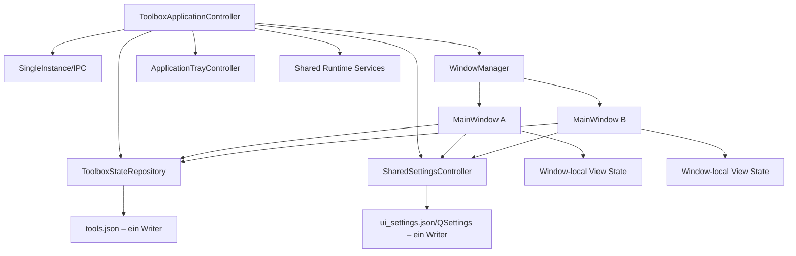

# Umsetzungsplan: Sichere Mehrfensterunterstützung mit gemeinsamem Zustand

Stand: 8. August 2026
Ausgangsstand: Git-Commit `7d0ebcd`
Automatisierte Baseline: 311 Tests bestanden

## 1. Ziel

Toolbox soll mehrere gleichzeitig sichtbare Hauptfenster innerhalb **eines Prozesses** unterstützen.
Alle Fenster greifen auf denselben kanonischen Toolbox-Zustand zu. Dadurch können unterschiedliche
Tabs nebeneinander betrachtet und bedient werden, ohne dass mehrere Prozesse dieselben JSON- und
QSettings-Dateien konkurrierend überschreiben.

Die bestehende Einzelinstanzkoordination bleibt erhalten. Ein zweiter Prozess übergibt lediglich
einen Befehl an den bereits laufenden Prozess. Dieser Befehl kann anschließend entweder das letzte
Fenster aktivieren oder ein neues Fenster im bestehenden Prozess erzeugen.

## 2. Verbindliche Produktentscheidungen

1. **Ein Prozess, mehrere Fenster:** Es werden keine unkoordinierten parallelen Toolbox-Prozesse
   mit demselben Konfigurationsordner zugelassen.
2. **Gemeinsamer Inhalt:** Tab-Reihenfolge, Tab-Titel, Einträge, Positionen, Abschnittsfarben und
   globale Einstellungen sind in allen Fenstern identisch.
3. **Fensterlokale Ansicht:** Aktiver Tab, Suche, Auswahl, Ordner-Browse-Verlauf, Scrollposition und
   temporäre Dialogzustände bleiben pro Fenster getrennt.
4. **Zentraler Writer:** Nur ein Repository darf `tools.json` schreiben. Nur ein
   Einstellungscontroller darf `ui_settings.json` und QSettings schreiben.
5. **Globale Undo-Historie:** Undo/Redo wirkt auf den zuletzt ausgeführten gemeinsamen
   Datenbefehl – unabhängig davon, aus welchem Fenster er kam.
6. **Ein Tray-Icon:** Tray-Icon und Tray-Menü gehören zur Anwendung, nicht zu einem einzelnen
   Fenster.
7. **`Ctrl+N` für ein neues Fenster:** `Ctrl+T` bleibt „neuer Tab“.
8. **Zweiter Start ist konfigurierbar:** Unter Einstellungen kann gewählt werden zwischen
   „vorhandenes Fenster aktivieren“ und „neues Fenster öffnen“. Für bestehende Profile bleibt
   zunächst „vorhandenes Fenster aktivieren“ der migrationssichere Standard.
9. **Kein automatisches Wiederherstellen aller Fenster in Version 1:** Beim normalen Programmstart
   wird zunächst ein Hauptfenster geöffnet. Fensteranzahl und Fensteranordnung können später als
   eigenständige Erweiterung ergänzt werden.

## 3. Nicht Bestandteil dieser Umsetzung

- Mehrere unabhängige Prozesse mit demselben Profil
- Gleichzeitig geöffnete, getrennte Profile wie `--profile arbeit` und `--profile privat`
- Netzwerk- oder Cloud-Synchronisation
- Verschieben eines Tabs in einen anderen Prozess
- Automatische Konfliktauflösung für extern manuell veränderte JSON-Dateien während der Laufzeit
- Vollständige Sitzungswiederherstellung über mehrere Monitore beim ersten Release

Ein späteres Profilsystem bleibt möglich, soll aber nicht mit der Mehrfensterarchitektur vermischt
werden.

## 4. Analyse des aktuellen Zustands

### 4.1 Einzelinstanz

`app/application_controller.py` verwendet einen benutzerspezifischen `QLocalServer`. Ein zweiter
Start sendet derzeit ausschließlich `ACTIVATE` und beendet sich anschließend erfolgreich.

### 4.2 Datenhaltung

- `MainWindow.toolbox_tabs` enthält gleichzeitig UI-Widgets und veränderbare Eintragslisten.
- `ToolboxTabContext` vermischt persistente Daten mit fensterlokalem UI-Zustand.
- `persist_toolbox_state()` sammelt den Zustand direkt aus einem Fenster und schreibt
  `tools.json`.
- Undo/Redo wird aktuell pro `MainWindow` geführt.
- Mehrere Fenster würden deshalb jeweils veraltete Kopien desselben Zustands besitzen.

### 4.3 Anwendungsweite Dienste

Folgende Dienste werden aktuell im Hauptfenster erzeugt, sind bei mehreren Fenstern aber teilweise
anwendungsweit zu behandeln:

- `FolderCountService`
- `AppImageIconService`
- `DesktopProcessManager`
- Tray-Icon und Tray-Menü
- persistenter Toolbox-State
- globale Einstellungen

Der Größenberechnungsdienst und rein visuelle Vorschauen dürfen weiterhin fensterlokal bleiben,
sofern ihre Ergebnisse eindeutig einem Fenster zugeordnet werden.

### 4.4 Hauptrisiko

Atomare Dateischreibvorgänge verhindern unvollständige JSON-Dateien, verhindern aber nicht, dass
Fenster A den neueren Zustand von Fenster B mit einem älteren Snapshot überschreibt. Deshalb darf
die Mehrfensterfunktion nicht durch bloßes Entfernen der Einzelinstanzsperre umgesetzt werden.

## 5. Zielarchitektur



### 5.1 Zuständigkeiten

| Komponente | Verantwortlich für | Darf nicht besitzen |
|---|---|---|
| `ToolboxApplicationController` | Start, Shutdown, IPC, anwendungsweite Komponenten | Tab-Widgets oder Canvas-Zustand |
| `WindowManager` | Fenster erzeugen, aktivieren, schließen, letztes aktives Fenster | Persistente Toolbox-Daten |
| `ToolboxStateRepository` | Kanonische Tabs/Einträge, Commands, Revision, Undo/Redo, Persistenz | Qt-Widgets |
| `SharedSettingsController` | Angewendete globale Einstellungen, Revision, Speichern, Broadcast | Fenstergeometrie einzelner Fenster |
| `ApplicationTrayController` | genau ein Tray-Icon, Menü, Show/New Window/Quit | fensterspezifische Settings-Widgets |
| `MainWindow` | Darstellung, fensterlokale Auswahl/Suche/Browse, Weitergabe von Commands | direktes Schreiben von `tools.json` |
| `ToolboxTabViewContext` | Widgets und rein lokaler Ansichtszustand eines Tabs | kanonische Eintragslisten |

### 5.2 Kanonisches Modell

Das Repository verwaltet weiterhin `ToolboxTabData` und `ToolboxEntry`, gibt nach außen aber keine
frei veränderbaren Listen zurück. Vorgesehen sind:

- unveränderliche oder defensive Snapshots für Views,
- lesende Abfragen nach `tab_id` und `entry_id`,
- klar benannte Mutationsbefehle,
- eine monoton steigende `revision`,
- strukturierte Änderungssignale mit betroffenen Tab- und Entry-IDs.

Beispielbefehle:

- `create_tab(...)`
- `rename_tab(tab_id, title)`
- `delete_tab(tab_id)`
- `reorder_tabs(tab_ids)`
- `add_entries(tab_id, entries)`
- `update_entry(tab_id, entry_id, changes)`
- `move_entries(tab_id, positions)`
- `delete_entries(tab_id, entry_ids)`
- `set_tab_background(tab_id, color)`
- `set_section_colors(...)`
- `undo()` und `redo()`

Jeder erfolgreiche Command erzeugt maximal einen Undo-Schritt, eine neue Revision, ein
Änderungssignal und einen geplanten Persistenzvorgang.

### 5.3 Änderungssignale

Ein `ToolboxStateChange` soll mindestens enthalten:

- `revision`
- `origin_window_id`
- `kind`
- `affected_tab_ids`
- `affected_entry_ids`
- `structural_change`

Das Ursprungsfenster erhält dasselbe Signal wie alle anderen Fenster. Dadurch existiert nur ein
Renderpfad und keine Sonderlogik, die später auseinanderlaufen kann.

### 5.4 Fensterlokaler Zustand

Pro Fenster werden separat gehalten:

- `window_id`
- aktive `tab_id`
- Suchtext pro Tab
- ausgewählte Entry-IDs pro Tab
- Browse-Stack und temporäre Browse-Einträge
- Scrollposition pro Tab
- Fenstergeometrie während der Laufzeit
- offene Dialoge und Hover-Vorschau

Diese Daten lösen keine gemeinsame Persistenz von `tools.json` aus.

## 6. Sprintplan

## Sprint 0: Baseline, Verträge und Sicherheitsnetz

### Ziel

Das aktuelle Verhalten wird messbar festgehalten, bevor Zuständigkeiten verschoben werden.

### Aufgaben

1. Aktuelle 311 Tests als Baseline ausführen und Ergebnis dokumentieren.
2. Direkte Schreibpfade für `tools.json`, `ui_settings.json` und QSettings vollständig inventarisieren.
3. Alle Stellen erfassen, die `ctx.entries`, `ctx.title`, `ctx.background_color` oder Tab-Reihenfolge
   direkt verändern.
4. Lebenszyklus von Tray, Services, `aboutToQuit`, `closeEvent()` und `_begin_shutdown()` erfassen.
5. Charakterisierungstests für folgende bestehende Abläufe ergänzen:
   - Tab erstellen/umbenennen/löschen,
   - Eintrag hinzufügen/verschieben/löschen,
   - Undo/Redo,
   - Settings anwenden,
   - Schließen mit und ohne Minimize-to-Tray,
   - zweiter Prozess aktiviert das vorhandene Fenster.
6. Testhelfer für mehrere gleichzeitig geöffnete `MainWindow`-Objekte vorbereiten.

### Tests

- Bestehende Gesamtsuite bleibt grün.
- Neuer Test `tests/test_multi_window_baseline.py` dokumentiert, dass zwei unkoordinierte
  `MainWindow`-Objekte aktuell noch getrennte Modelle besitzen.
- Schreibpfadtest stellt sicher, dass spätere Sprints keine versteckten direkten Storage-Aufrufe
  übersehen.

### Abnahmekriterien

- Baseline und bekannte direkte Mutationen sind vollständig dokumentiert.
- Keine Produktfunktion wurde in diesem Sprint verändert.

## Sprint 1: UI-freies gemeinsames State-Repository

### Ziel

Persistente Toolbox-Daten werden aus `MainWindow` und `ToolboxTabContext` herausgelöst.

### Aufgaben

1. Neues Modul `app/state/toolbox_repository.py` anlegen.
2. Repository lädt den vorhandenen `version: 3`-Datensatz über `app/services/storage.py`.
3. Defensive Snapshots und ID-basierte Lesemethoden implementieren.
4. Revisionszähler und `state_changed`-Signal implementieren.
5. Command-API für Tabs, Entries, Positionen und Farben implementieren.
6. Invarianten zentral erzwingen:
   - genau ein primärer Tab,
   - mindestens ein Tab,
   - eindeutige Tab-IDs,
   - eindeutige Entry-IDs innerhalb eines Tabs,
   - keine Mutation unbekannter IDs.
7. Persistenz über einen einzigen, kurzen Debounce-Timer bündeln.
8. `flush()` für Shutdown, Export und besonders kritische Aktionen bereitstellen.
9. Schreibfehler signalisieren und den letzten fehlerfreien In-Memory-Zustand behalten.

### Tests

Neue Datei `tests/test_toolbox_state_repository.py`:

- Laden leerer, aktueller und alter Konfigurationen
- defensive Snapshots können Repository-Daten nicht extern verändern
- jeder Command erhöht die Revision genau einmal
- No-op-Commands erzeugen weder Revision noch Dateischreibvorgang
- Tab- und Entry-Invarianten
- Debounce fasst schnelle Positionsänderungen zusammen
- `flush()` schreibt sofort
- atomarer Schreibfehler wird gemeldet und zerstört den In-Memory-Zustand nicht
- zwei Repository-Consumer sehen denselben Snapshot

### Abnahmekriterien

- Repository enthält keinerlei Widget-Referenz.
- `tools.json` wird ausschließlich über das Repository geschrieben.
- Dateiformat bleibt rückwärtskompatibel.

## Sprint 2: Globale Command-Historie und Undo/Redo

### Ziel

Undo/Redo funktioniert konsistent über alle Fenster hinweg.

### Aufgaben

1. Undo- und Redo-Stacks aus `MainWindowTabsMixin` in das Repository verschieben.
2. Command-Grenzen definieren, insbesondere für Multi-Select-Drag und Bulk-Farbänderungen.
3. Herkunftsfenster im History-Eintrag speichern, ohne Undo auf dieses Fenster zu beschränken.
4. Undo/Redo-Signale an alle Views senden.
5. History-Limit und Speicherverbrauch beibehalten beziehungsweise explizit begrenzen.
6. Browse-Zustand, Suche und Auswahl ausdrücklich von der globalen History ausschließen.

### Tests

- Fenster A verschiebt einen Eintrag; Fenster B führt Undo aus; beide sehen die alte Position.
- Redo in Fenster A stellt den Zustand in beiden Fenstern wieder her.
- Ein Multi-Select-Drag ist genau ein History-Schritt.
- Tab-Löschen und Wiederherstellen bewahrt IDs, Titel, Farben und Entries.
- No-op und abgebrochene Dialoge erzeugen keinen History-Eintrag.
- History-Limit entfernt nur die ältesten vollständigen Commands.

### Abnahmekriterien

- Es existiert nur noch eine wirksame Undo-/Redo-Historie.
- Kein Fenster kann einen anderen, neueren Zustand durch einen lokalen Snapshot ersetzen.

## Sprint 3: Fenster als synchronisierte Views

### Ziel

Mehrere `MainWindow`-Objekte können dasselbe Repository gleichzeitig darstellen.

### Aufgaben

1. Persistente Felder aus `ToolboxTabContext` entfernen oder klar von einem neuen
   `ToolboxTabViewContext` trennen.
2. `MainWindow` erhält Repository und Shared Services per Constructor Injection.
3. Beim Fensteraufbau werden Tab-Views aus Repository-Snapshots erzeugt.
4. Alle direkten Mutationen in Entry-, Tab-, Drag-, Section- und Diagnose-Controllern durch
   Repository-Commands ersetzen.
5. Repository-Signale inkrementell verarbeiten:
   - reine Entry-Änderung aktualisiert nur betroffene Kacheln/Canvas,
   - strukturelle Änderung baut betroffene Tab-Leisten neu,
   - globale Layoutänderung aktualisiert alle Fenster.
6. Signal- und Render-Schleifen mit Guard/Revision verhindern.
7. Fensterlokale Auswahl, Suche und Browse-Stacks beibehalten.
8. Wird ein ausgewählter Entry in einem anderen Fenster gelöscht, wird die lokale Auswahl sicher
   bereinigt.
9. Wird der aktive Tab gelöscht, wählt jedes Fenster selbstständig einen gültigen Nachbartab.

### Tests

Neue Datei `tests/test_multi_window_sync.py`:

- Fenster A und B verwenden dieselbe Repository-Instanz
- Add/Rename/Delete/Move aus A erscheint in B
- Änderungen aus B erscheinen in A
- unterschiedliche aktive Tabs bleiben unabhängig
- unterschiedliche Suchtexte und Auswahlen bleiben unabhängig
- Browse-Modus in A beeinflusst B nicht
- Löschen eines in B ausgewählten Entries bereinigt B ohne Fehler
- Tab-Reihenfolge und Tab-Sichtbarkeit synchronisieren sich
- ein Signal erzeugt keine rekursive zweite Mutation
- Fenster kann während eines Broadcasts geschlossen werden

### Abnahmekriterien

- Kein Feature-Controller schreibt mehr direkt persistente Daten in einen View-Context.
- Zwei Fenster bleiben nach allen CRUD- und Drag-Aktionen synchron.

## Sprint 4: WindowManager und Benutzeroberfläche für neue Fenster

### Ziel

Neue Fenster können kontrolliert erzeugt, aktiviert und geschlossen werden.

### Aufgaben

1. Neues Modul `app/window_manager.py` anlegen.
2. Stabile, laufzeitlokale `window_id` vergeben.
3. Liste schwacher oder kontrolliert besessener Fensterreferenzen verwalten.
4. `create_window(preferred_tab_id=None)` implementieren.
5. Neues Fenster leicht versetzt zur letzten Fensterposition anzeigen und vollständig auf dem
   aktuellen Bildschirm halten.
6. Letztes aktives Fenster verfolgen.
7. Menüaktion „New Window“ und Shortcut `Ctrl+N` ergänzen.
8. Optional Tab-Kontextaktion „Open This Tab in New Window“ ergänzen; sie öffnet eine zweite View,
   verschiebt oder dupliziert aber keine Daten.
9. Fenstertitel bei mehreren Fenstern unterscheidbar machen, beispielsweise
   `Toolbox — <aktiver Tab>`.
10. Settings- und Help-Ansicht in jedem Fenster weiterhin erreichbar halten.

### Tests

Neue Datei `tests/test_window_manager.py`:

- erstes und zweites Fenster werden registriert
- `Ctrl+N` erzeugt genau ein zusätzliches Fenster
- bevorzugte Tab-ID wird im neuen Fenster aktiviert
- ungültige Tab-ID fällt sicher auf einen gültigen Tab zurück
- Aktivierung verwendet das letzte aktive Fenster
- Schließen entfernt nur das Ziel-Fenster aus der Registry
- Fensterposition wird sichtbar und innerhalb der Bildschirmgeometrie gewählt
- keine starken Referenzzyklen nach dem Schließen

### Abnahmekriterien

- Mindestens zwei Fenster können gleichzeitig sichtbar bedient werden.
- Das Schließen eines Fensters beendet nicht unbeabsichtigt andere Fenster.

## Sprint 5: IPC und Verhalten beim zweiten Programmstart

### Ziel

Der zweite Prozess kann gezielt ein Fenster aktivieren oder ein neues Fenster anfordern.

### Aufgaben

1. Rohbefehl `ACTIVATE` durch ein kleines versioniertes IPC-Protokoll ergänzen.
2. Unterstützte Befehle:
   - `activate`
   - `new_window`
   - optional `open_paths` für spätere Desktopintegration
3. Nachrichtenlänge begrenzen und ungültige JSON-/Command-Daten ablehnen.
4. Partiell eintreffende Socket-Daten puffern; nicht davon ausgehen, dass eine Nachricht in einem
   `readyRead` vollständig ist.
5. Neue globale Einstellung `second_launch_action` einführen.
6. CLI-Optionen ergänzen:
   - `--new-window`
   - `--activate-existing`
7. Priorität definieren: explizite CLI-Option schlägt gespeicherte Einstellung.
8. Smoke-Test-Isolation über `TOOLBOX_INSTANCE_KEY` unverändert erhalten.
9. Der zweite Prozess darf niemals selbst `tools.json` oder UI-Settings laden/schreiben, wenn er
   lediglich einen IPC-Befehl weitergibt.

### Tests

`tests/test_application_controller.py` erweitern:

- `activate` aktiviert das letzte Fenster
- `new_window` erzeugt genau ein neues Fenster
- gespeicherte Second-Launch-Einstellung wird beachtet
- CLI-Override besitzt Vorrang
- aufgeteilte Socket-Nachricht wird korrekt zusammengesetzt
- übergroße oder unbekannte Nachricht wird abgewiesen
- Race bei zwei gleichzeitigen Starts erzeugt weiterhin genau einen Primärprozess
- stale Socket wird erst nach Retry entfernt
- sekundärer Prozess berührt keine Konfigurationsdatei
- AppImage-Smoke-Test bleibt isoliert

### Abnahmekriterien

- Doppelstart kann zuverlässig ein neues Fenster im vorhandenen Prozess öffnen.
- Es läuft weiterhin nur ein konfigurationsschreibender Prozess.

## Sprint 6: Gemeinsame Einstellungen und Konfliktfreie Settings-UI

### Ziel

Globale Einstellungen werden aus jedem Fenster konsistent bearbeitet und angewendet.

### Aufgaben

1. `SharedSettingsController` mit angewendetem Snapshot und `settings_revision` einführen.
2. QSettings-/JSON-Speicherung aus dem einzelnen Fenster herauslösen.
3. Jede Settings-View arbeitet mit einer Draft-Revision.
4. Bei „Save & Apply“:
   - Draft gegen aktuelle Revision prüfen,
   - normalisierte Werte zentral anwenden,
   - einmal speichern,
   - alle Fenster aktualisieren,
   - alle Settings-Views auf denselben Stand setzen.
5. Konfliktstrategie festlegen: Wurde eine andere Settings-Revision angewendet, während ein Fenster
   einen älteren Draft besitzt, darf dieser nicht still überschreiben. Das Fenster erhält
   „Neu laden“ oder „Änderungen verwerfen und übernehmen“.
6. Fensterlokale Geometrie und aktiver Tab aus globalen Design-/Verhaltenseinstellungen trennen.
7. Splittergrößen nicht mehr unkoordiniert unter einem globalen Tab-Key aus mehreren Fenstern
   schreiben. Für Version 1 werden sie nur fensterlokal gehalten oder ausschließlich vom zuletzt
   aktiven Hauptfenster persistiert.
8. Änderungen an Icongröße, Schriftgröße, Tray, Tooltips und Dateizuordnungen an alle Fenster
   broadcasten.

### Tests

Neue Datei `tests/test_multi_window_settings.py`:

- Apply in A aktualisiert Canvas und Widgets in B
- JSON und QSettings werden pro Apply genau einmal geschrieben
- B mit altem Draft überschreibt keine neuere Revision aus A
- Reload löst Konflikt korrekt
- automatische Apply-Logik beim Verlassen der Settings erzeugt nur eine Revision
- globale Tray-Einstellung wirkt unabhängig davon, aus welchem Fenster sie geändert wurde
- Import eines Profils aktualisiert alle Fenster atomar
- Export verwendet ausschließlich den angewendeten gemeinsamen Snapshot
- alte UI-Settings ohne neue Felder laden mit kompatiblen Defaults

### Abnahmekriterien

- Kein Fenster besitzt einen unabhängigen angewendeten Settings-Zustand.
- Veraltete Settings-Drafts können keine neueren Werte still überschreiben.

## Sprint 7: Tray-, Fenster- und Shutdown-Lebenszyklus

### Ziel

Mehrere Fenster, Tray-Verhalten und vollständiges Beenden besitzen eindeutige Semantik.

### Aufgaben

1. Tray-Erzeugung aus `MainWindow` in `ApplicationTrayController` verschieben.
2. Genau ein Tray-Icon und ein Tray-Menü pro Prozess sicherstellen.
3. Tray-Menü ergänzen:
   - „Show Last Window“
   - „New Window“
   - optional Liste geöffneter Fenster
   - „Quit Toolbox“
4. Schließregeln implementieren:
   - mehrere Fenster offen: Ziel-Fenster schließen, übrige bleiben aktiv,
   - letztes Fenster + Minimize-to-Tray: letztes Fenster verstecken,
   - letztes Fenster ohne Minimize-to-Tray: Anwendung beenden,
   - Force Quit: alle Fenster schließen und genau einmal flushen.
5. Tray-Klick zeigt das letzte versteckte Fenster oder erzeugt eines, falls kein Fensterobjekt mehr
   existiert.
6. Shared Services erst beim vollständigen Anwendungsende herunterfahren.
7. Fensterlokale Dienste beim jeweiligen Fensterschließen abbrechen.
8. Persistenz und Shutdown idempotent gestalten.

### Tests

Neue Datei `tests/test_multi_window_lifecycle.py`:

- Schließen von A lässt B und Shared Services aktiv
- Schließen des letzten Fensters beendet ohne Tray-Modus
- Schließen des letzten Fensters versteckt mit Tray-Modus
- Tray „New Window“ erzeugt ein Fenster
- Tray „Show Last Window“ aktiviert das richtige Fenster
- Force Quit schließt alle Fenster
- Repository, AppImage-Service, FolderCount-Service und ProcessManager werden genau einmal beendet
- mehrfacher Quit-/Close-Aufruf bleibt idempotent
- kein Zugriff auf bereits gelöschte Fensterreferenzen
- genau ein Tray-Icon bei beliebig vielen Fenstern

### Abnahmekriterien

- Tray und Shutdown verhalten sich bei 0, 1 und mehreren Fenstern deterministisch.
- Kein Service wird zu früh oder mehrfach beendet.

## Sprint 8: Performance, Fehlerfälle und Robustheit

### Ziel

Mehrfenstersynchronisation bleibt auch bei vielen Einträgen reaktionsfähig und fehlertolerant.

### Aufgaben

1. ChangeSets statt vollständiger Neuaufbauten verwenden, wo dies messbar sinnvoll ist.
2. Burst-Änderungen wie Dragging und Bulk-Farben bündeln.
3. Langsame View darf Repository und andere Fenster nicht blockieren.
4. Fehler in einer View protokollieren, ohne den gemeinsamen State zu verlieren.
5. Repository-Revisionslücken erkennen; View lädt dann einen vollständigen Snapshot neu.
6. Geschlossene Fenster vor verspäteten Worker-/Signalantworten schützen.
7. Speicher- und Signal-Leaks mit wiederholtem Öffnen/Schließen prüfen.
8. Logging um `window_id`, `revision` und Command-Art ergänzen.

### Tests

- 2 Fenster × 20 Tabs × 500 Entries mit synthetischen Änderungen
- 100 schnelle Move-Events ergeben begrenzte Persistenz- und Renderaufrufe
- langsamer/fehlerhafter Consumer blockiert Repository nicht dauerhaft
- übersprungene Revision löst Snapshot-Recovery aus
- verspätete Thumbnail-, FolderCount- und AppImage-Icon-Signale treffen kein gelöschtes Fenster
- 50-mal Fenster öffnen/schließen erzeugt keine wachsende WindowManager-Registry
- Speichern während eines Bursts schreibt einen konsistenten Endzustand

### Abnahmekriterien

- Keine merkliche GUI-Blockade bei normalen Toolbox-Größen.
- Kein reproduzierbarer Signal-, Fenster- oder Worker-Leak.

## Sprint 9: AppImage, Dokumentation und Endabnahme

### Ziel

Die Funktion ist unter Linux Mint 22.3 als AppImage vollständig nutzbar und dokumentiert.

### Aufgaben

1. README, Help-Tab und Changelog um `Ctrl+N`, Mehrfensterverhalten und Second-Launch-Einstellung
   ergänzen.
2. AppImage-Test um einen echten Primärprozess und einen zweiten `--new-window`-Start erweitern.
3. Über X11 prüfen, dass danach zwei Toolbox-Fenster demselben PID zugeordnet sind.
4. Sicherstellen, dass weiterhin nur ein Tray-Item registriert ist.
5. Konfigurationsmanifest vor/nach einem sekundären Prozess vergleichen.
6. Zwei vollständige reproduzierbare AppImage-Builds durchführen.
7. Manuelle Testmatrix auf Linux Mint 22.3 durchführen.

### Automatisierte Release-Tests

- vollständige pytest-Suite
- Ruff, `compileall`, `git diff --check`
- Desktop-/AppStream-Validierung
- AppDir- und AppImage-Inhaltsprüfung
- normales AppImage und `--appimage-extract-and-run`
- X11: zwei Fenster, ein PID, ein Tray-Item
- sekundärer Start mit `activate`
- sekundärer Start mit `new_window`
- Pfade mit Leerzeichen, umbenanntes AppImage und Symlink
- Read-only-Verzeichnis
- aktive Normalinstanz während isoliertem Smoke-Test
- Reproduzierbarkeitsvergleich inklusive Dateimodi und Symlinks

### Manuelle Testmatrix

1. `Ctrl+N` öffnet ein zweites Fenster.
2. Fenster A und B zeigen unterschiedliche aktive Tabs.
3. Eintrag in A hinzufügen; B aktualisiert sich sofort.
4. Eintrag in B verschieben; A zeigt die neue Position.
5. Undo in A macht die letzte Änderung aus B rückgängig.
6. Suche und Auswahl bleiben pro Fenster unabhängig.
7. Folder-Browse in A verändert B nicht.
8. Settings in A anwenden; Darstellung in B aktualisiert sich.
9. Gleichzeitiger veralteter Settings-Draft erzeugt einen verständlichen Konflikthinweis.
10. Zweiter AppImage-Start folgt der konfigurierten Aktion.
11. Schließen eines von zwei Fenstern beendet die Anwendung nicht.
12. Schließen des letzten Fensters folgt der Tray-Einstellung.
13. Tray „New Window“, „Show Last Window“ und „Quit“ funktionieren.
14. Nach Neustart ist der letzte gemeinsame Toolbox-Zustand vollständig vorhanden.
15. Drag-and-drop von Dateien, `.desktop`-Dateien und AppImages funktioniert in beiden Fenstern.

### Abnahmekriterien

- Alle automatisierten Tests bestehen.
- Zwei reproduzierbare AppImages besitzen denselben SHA-256-Wert.
- Manuelle Matrix ist dokumentiert abgehakt.
- Keine verlorenen Änderungen oder doppelten Tray-Icons.

## 7. Vorgesehene Dateistruktur

Neue beziehungsweise wesentlich geänderte Module:

```text
app/
  application_controller.py       # Prozessstart und IPC-Protokoll
  window_manager.py                # Besitz und Lebenszyklus aller Fenster
  tray_controller.py               # genau ein anwendungsweites Tray-Icon
  state/
    __init__.py
    toolbox_repository.py          # kanonischer Toolbox-State, Commands, Undo, Persistenz
    change_set.py                  # strukturierte Änderungen und Revisionen
    settings_controller.py         # globale Settings, Draft-/Konfliktlogik
  domain/
    models.py                      # persistente Datenmodelle
    tab_context.py                 # auf fensterlokalen View-Context reduzieren
  main_window.py                   # reine Fenster-/View-Orchestrierung
```

Vorgesehene neue Tests:

```text
tests/test_multi_window_baseline.py
tests/test_toolbox_state_repository.py
tests/test_multi_window_undo.py
tests/test_multi_window_sync.py
tests/test_window_manager.py
tests/test_multi_window_settings.py
tests/test_multi_window_lifecycle.py
tests/test_multi_window_performance.py
```

## 8. Persistenz und Migration

1. `tools.json` bleibt zunächst bei Schema-Version 3, sofern keine neue persistente Information
   benötigt wird.
2. Bestehende Tab- und Entry-IDs bleiben unverändert.
3. Fehlende Einstellung `second_launch_action` migriert zu `activate_existing`.
4. Bestehende Fensterbreite/-höhe wird für das erste Fenster verwendet.
5. Neue Fenster erhalten zunächst dieselbe Größe mit versetzter Position; sie überschreiben nicht
   unkoordiniert globale Geometriewerte.
6. Vor einer Schemaänderung wird ein vollständiger Roundtrip-Test für alte reale Fixture-Dateien
   benötigt.
7. Bei fehlgeschlagener Migration bleibt die Quelldatei unverändert und Toolbox startet mit einer
   verständlichen Fehlermeldung beziehungsweise einem sicheren Read-only-Fallback.

## 9. Risiken und Gegenmaßnahmen

| Risiko | Gegenmaßnahme |
|---|---|
| Rekursive Signal-/Render-Schleife | Revision und Origin-ID, Signalblocker, ein gemeinsamer Renderpfad |
| Veraltete View überschreibt neuen Zustand | keine freien Modelllisten; ausschließlich Repository-Commands |
| Zwei Settings-Drafts kollidieren | Draft-Basisrevision und explizite Konfliktentscheidung |
| Undo aus anderem Fenster überrascht | globales Verhalten dokumentieren und Statusmeldung mit Ursprung anzeigen |
| Zu viele vollständige Canvas-Neuaufbauten | ChangeSets und tabbezogene inkrementelle Aktualisierung |
| Letztes Fenster geschlossen, Prozess bleibt unsichtbar | WindowManager/Tray-Zustandsautomat und Lifecycle-Tests |
| Mehrere Tray-Icons | Tray ausschließlich im Application Controller besitzen |
| Worker antwortet an geschlossenes Fenster | QObject-Ownership, Generationen und Disconnect beim Fensterabbau |
| Persistenz bei schnellem Shutdown ausstehend | zentrales `flush()` vor Service-Shutdown |
| Große Refaktorierung erschwert Rücknahme | Sprints einzeln testbar und jeweils commitfähig halten |

## 10. Empfohlene Commit-Aufteilung

1. `test: capture multi-window state and lifecycle baseline`
2. `refactor: add shared toolbox state repository`
3. `refactor: centralize toolbox undo and persistence`
4. `feat: synchronize toolbox state across windows`
5. `feat: add managed toolbox windows and Ctrl+N`
6. `feat: support new-window single-instance commands`
7. `refactor: centralize shared settings across windows`
8. `fix: unify multi-window tray and shutdown lifecycle`
9. `test: harden multi-window performance and release coverage`
10. `docs: document multi-window Toolbox behavior`

Jeder Commit muss einzeln kompilieren und die für seinen Sprint relevanten Tests bestehen. Ein
Commit darf nicht gleichzeitig die Einzelinstanzsperre entfernen und den zentralen Writer erst in
einem späteren Commit ergänzen.

## 11. Definition of Done

Die Mehrfensterfunktion gilt erst als abgeschlossen, wenn alle folgenden Punkte erfüllt sind:

- Mehrere sichtbare Toolbox-Fenster laufen in genau einem Prozess.
- `Ctrl+N` und IPC-`new_window` funktionieren.
- Alle Fenster zeigen denselben kanonischen persistenten Zustand.
- Auswahl, Suche, aktiver Tab und Browse-Modus bleiben fensterlokal.
- Undo/Redo ist global konsistent.
- Nur ein Repository schreibt `tools.json`.
- Nur ein Settings-Controller schreibt UI-Settings und QSettings.
- Settings-Konflikte werden erkannt und nicht still überschrieben.
- Es existiert genau ein Tray-Icon.
- Schließen und Beenden funktionieren bei 0, 1 und mehreren Fenstern korrekt.
- Shared Services werden genau einmal heruntergefahren.
- Bestehende Konfigurationen werden ohne Datenverlust geladen.
- Automatisierte Suite, AppImage-Abnahme und manuelle Linux-Mint-Matrix sind grün.

## 12. Umsetzungs- und Abnahmeprotokoll

Stand: 8. August 2026

- Gemeinsames `ToolboxStateRepository` mit defensiven Snapshots, Revisionen,
  Invarianten, Debounce, `flush()`, Fehler-Signal und globalem Undo/Redo umgesetzt.
- Alle produktiv durch `WindowManager` erstellten Fenster schreiben Toolbox-Daten
  ausschließlich über dieses Repository. Bestehende direkte Storage-Pfade bleiben
  nur als Rückwärtskompatibilität für isoliert erzeugte Legacy-/Testfenster erhalten.
- Synchronisierte Mehrfenster-Views, fensterlokale Suche, Auswahl, aktiver Tab und
  Browse-Verlauf sowie inkrementelle Entry-Aktualisierung umgesetzt.
- `WindowManager`, stabile Window-IDs, versetzte Positionierung, `Ctrl+N` und
  „Open This Tab in New Window“ umgesetzt.
- Versioniertes, größenbegrenztes und gepuffertes IPC für `activate` und
  `new_window` einschließlich CLI-Overrides umgesetzt.
- Zentraler Settings-Writer mit Revision/Broadcast, Draft-Konflikterkennung und
  expliziter Reload-/Overwrite-Entscheidung umgesetzt.
- Ein anwendungsweites Tray-Icon mit Show/New Window/Quit und definierter
  Mehrfenster-Schließlogik umgesetzt.
- Gemeinsame FolderCount- und AppImage-Icon-Dienste werden erst beim vollständigen
  Anwendungs-Shutdown genau einmal beendet.
- README, Help und Changelog aktualisiert.
- Automatisierte Suite: 337 Tests bestanden.
- Ruff, `compileall`, `git diff --check`, Desktop- und AppStream-Validierung bestanden.
- AppDir-/AppImage-Inhalts-, Smoke-, Relocation-, Read-only- und X11-Tests bestanden.
- Echter X11-Doppelstart mit `--new-window`: zwei Fenster im selben primären PID.
- Der Abschlussaudit ergänzte Revisionsschutz gegen veraltete View-Snapshots,
  identitätserhaltende Modell-Reconciliation bei strukturellen Broadcasts,
  synchronisierte Fenstertitel und zusätzliche Race-/Lifecycle-Tests.
- Der X11-Test verifiziert zusätzlich, dass der Sekundärprozess beim Anfordern
  eines neuen Fensters keine Konfigurationsdatei verändert.
- Zwei finale reproduzierbare Builds erzeugten denselben SHA-256-Wert:
  `560767333da90877bfbc3eb48c73959a1200515e54d21f1d449fab90e8bb2dde`.
- Abnahmeplattform: Linux Mint 22.3 (Zena), x86_64, X11.
